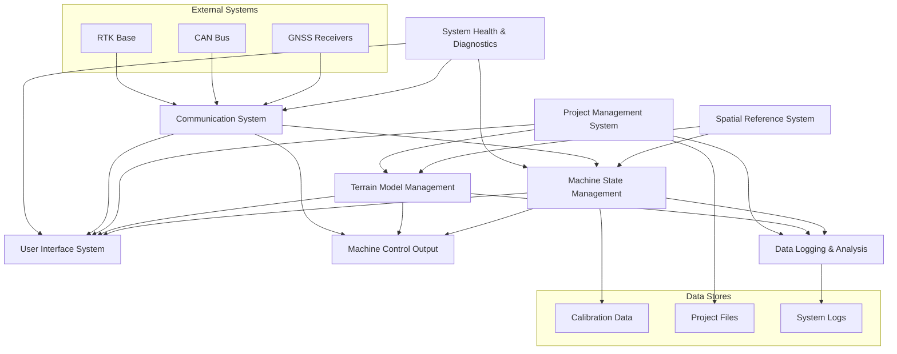

# Machine Control System Architecture Overview

## Introduction
This document outlines the major architectural components of a machine control system designed for heavy earthmoving equipment. The system enables operators to accurately follow specified terrain designs through integration of GNSS receivers, onboard sensors, and automated control systems.

## System Components

### 1. Machine State Management
The system maintains an accurate real-time model of the machine's state and configuration.

Key Responsibilities:
- Process input from multiple GNSS receivers
- Integrate data from angular sensors and encoders
- Calculate real-time machine geometry and position
- Maintain calibration parameters
- Monitor sensor health and accuracy

### 2. Communication System
Manages all data flow between system components.

Key Responsibilities:
- Handle sensor data streams
- Manage CAN bus communication
- Process RTK correction data
- Support inter-process communication
- Handle network connectivity
- Manage data synchronization

### 3. Terrain Model Management
Handles various types of design surfaces and terrain representations.

Key Responsibilities:
- Support multiple terrain model formats (DEM, TIN, etc.)
- Handle 2D alignment data with 3D profiles
- Manage cross slopes and grade transitions
- Provide efficient spatial queries
- Support terrain model validation and verification

### 4. Machine Control Output
Manages automated control of machine components when supported.

Key Responsibilities:
- Generate hydraulic control outputs
- Handle blade height and slope control
- Provide operator guidance for manual control
- Manage control mode transitions
- Implement safety interlocks and limits

### 5. User Interface System
Provides operator interaction and system configuration capabilities.

Key Responsibilities:
- Display real-time positioning information
- Support system configuration and calibration
- Provide clear operator guidance
- Handle alarm and warning conditions
- Support multiple visualization modes
- Enable parameter adjustment and fine-tuning

### 6. Project Management System
Handles overall job configuration and data management.

Key Responsibilities:
- Manage project files and configurations
- Handle import/export of design data
- Store and retrieve calibration data
- Support multiple design surfaces per project
- Maintain project metadata and settings

### 7. Spatial Reference System
Manages all aspects of coordinate systems and transformations.

Key Responsibilities:
- Handle multiple coordinate reference systems
- Manage site calibrations and localizations
- Support real-time coordinate transformations
- Handle geoid models and height systems
- Maintain transformation accuracy metrics

### 8. Data Logging and Analysis
Provides comprehensive logging and analysis capabilities.

Key Responsibilities:
- Record machine positions and operations
- Track project progress and completion
- Support quality control analysis
- Enable post-processing and reporting
- Maintain diagnostic logs
- Support data export for external analysis

### 9. System Security, Error Handling Health and Diagnostics
Monitors and maintains overall system health while adhereing to current secure C++ best practices.

Key Responsibilities:
- Monitor sensor status and quality
- Track system performance metrics
- Manage error conditions
- Provide diagnostic information
- Handle system state transitions
- Implement fault detection and recovery
- Allow remote updating of the Operating System, firmware and software applications.

## Component Interactions

### Core System Interactions

1. Machine State Management (MSM) ↔ Communication System
   - Receives raw GNSS data streams
   - Processes CAN messages for sensor data
   - Sends machine state updates to other components

2. Machine State Management ↔ Machine Control Output
   - Provides real-time position and orientation
   - Receives control feedback status
   - Sends calibration parameters
   - Exchanges safety interlock status
   - Potentially add a feedback loop to check for anomolous behavior for further robustness

3. Terrain Model Management ↔ Machine Control Output
   - Provides target grade information
   - Supplies cross-slope requirements
   - Delivers terrain queries for look-ahead operations - if we know our speed and direction we can pre-query to increase performance.
   - Receives as-built data

4. Project Management System ↔ Terrain Model Management
   - Handles design surface loading/unloading
   - Manages multiple surface versions
   - Controls surface activation/deactivation
   - Coordinates design updates




### User Interface Interactions

1. UI System ↔ Machine State Management
   - Displays real-time position and orientation
   - Shows sensor status and quality metrics
   - Handles operator input for calibration
   - Presents warning/error conditions
   - TBD: It will be worth researching current machines in production and see what inputs are avilable

2. UI System ↔ Project Management
   - Project selection and loading
   - Configuration management
   - Design surface visualization
   - Progress reporting
   - Ensure the operator is not overloaded with information

## Data Flow
### Primary Data Paths

1. Position Data Flow
```
GNSS Receivers → Communication System → Machine State Management → 
[UI System, Machine Control Output, Data Logging]
```
- Update frequency: 20Hz minimum
- Includes: position, heading, accuracy metrics
- Transformation: raw GNSS → site coordinates → machine geometry

2. Control Data Flow
```
Terrain Model → Machine State Management → Machine Control Output → 
CAN Bus → Hydraulic Systems
```
- Update frequency: System-dependent (typically 50-100Hz)
- Includes: target elevations, slopes, control commands
- Critical path for real-time control

3. Project Data Flow
```
Project Management → [Terrain Model, Machine State] → 
[UI System, Machine Control Output]
```
- Update frequency: On-demand
- Includes: design surfaces, calibration data, configurations
- Cached locally for performance

### State Synchronization

1. Real-time State Updates
- Machine position and orientation (20Hz)
- Control system status (10Hz)
- Sensor health metrics (1Hz)
- System diagnostics (1Hz)

2. Persistent State Storage
- Project configurations (on change)
- Calibration parameters (on change)
- System logs (continuous)
- As-built data (configurable interval)

### Inter-Process Communication Patterns

1. High-Priority Messages
- Position updates
- Control commands
- Safety-critical status
- Error conditions
Implementation: Direct message passing or shared memory

2. Normal Priority Messages
- UI updates
- Progress tracking
- Status monitoring
Implementation: Message queue or pub/sub system

3. Low-Priority Messages
- Logging data
- Statistics
- Diagnostic information
Implementation: Message queue with buffering

### Error Handling Flows

1. Sensor Errors
```
Sensor → Communication System → Machine State Management → 
[UI System, Machine Control Output, System Health & Diagnostics]
```
- Immediate notification to operator
- Automatic fallback to degraded operation mode
- Logging for diagnostic purposes

2. Communication Errors
```
Communication System → System Health & Diagnostics → 
[UI System, Machine Control Output]
```
- Automatic retry mechanisms
- Graceful degradation of functionality
- Error recovery procedures

3. Control System Errors
```
Machine Control Output → Machine State Management → 
[UI System, System Health & Diagnostics]
```
- Immediate safety stops if necessary
- Operator notification
- Diagnostic data capture

## Critical Requirements

### Performance Requirements
- Real-time position updates (minimum 20Hz)
- Maximum control loop latency (TBD)
- Maximum memory size needs to be determined (TBD)
- Minimum processor performance needs to be determined (TBD)
- Terrain model query performance metrics need to be evaluated and minimized. (TBD)

### Safety Requirements
- Fail-safe behavior for all control outputs
- Comprehensive error checking
- Clear operator warnings
- Redundant safety checks

### Reliability Requirements
- Robust handling of sensor errors
- Graceful degradation of functionality
- Data integrity verification
- System state recovery

## Technology Stack
- Core Implementation: C++
    - In order to maintain compatibility with mobile devices, C++17 is the maximum supported standard.
    - For maximum portaibility, CMake will be for compiling the application.
    - The usage of boost libraries, when avilable, are preferable in areas that C++17 lacks.  that said, sticking with popular frameworks like Eigen, Protobuf, etc. are fine.
    - For package management, vcpkg will be used in manifest mode.
- User Interface: QML
    - The appliation needs to support both landscape and portrait mode.
    - The UI must be scable to high DPI screens.
- Platforms: Windows, Linux and Android.
- Modularity must be prioritized at all times.  All major systems outlined above need to be modularized and replaced or updated indepdently.
    - This is especially true with respect to Qt, to ensure that we adhere to all aspects of the LGPL 3 License.
- Documentation: We will use Doxygen for creating internal documentation.  Documentation will become part of the CI/CD pipeline and will be automatically generated as part of the build process.
    - Tools like pre-commit hooks and clang-tidy or cppcheck will be used to enforce inline documentation.
    - A template project will exist that oulines the expectation of any new product introduced into the application.
- Testing: We will utilize Google's Test and Mock libraries and make use of Azure's CI/CD pipeline for testing automation.  We will also consider utilizing Docker to ensure we can support a variety of environments.
- We will use Carlson Software's Terrain and Spatial Orientation.  In places our internal tools are lacking we can consider GDAL/OGR, CGAL, and PROJ.
- For logging spdlog will be used (https://github.com/gabime/spdlog)
- We need to think about security from the beginning.  Ensure software and hardware are all remotely upgradeable.
- External Communications: CAN (J1939, CANOpen, Eyeride JSON API)

## Future Considerations
[Section to be expanded with potential future capabilities and expansion points]